# Guide des Captures d'Écran

Ce document présente les captures d'écran du déploiement et de la configuration de l'application Todo App avec Docker et Kubernetes.

## Liste des Captures d'Écran

### 1. Images Docker

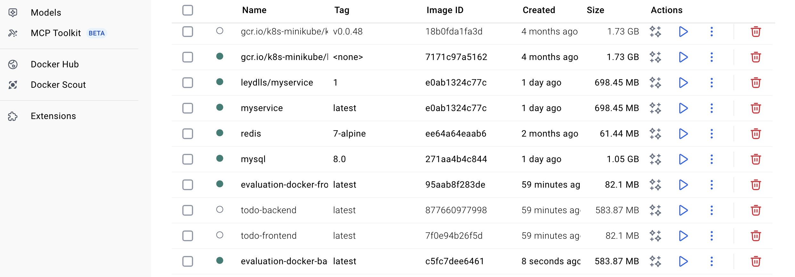

Construction et visualisation des images Docker pour le backend et le frontend.

---

### 2. Docker Compose

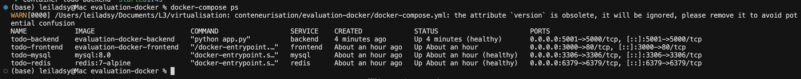

Déploiement avec Docker Compose - lancement des conteneurs, configuration du réseau et vérification du statut.

---

### 3. Minikube

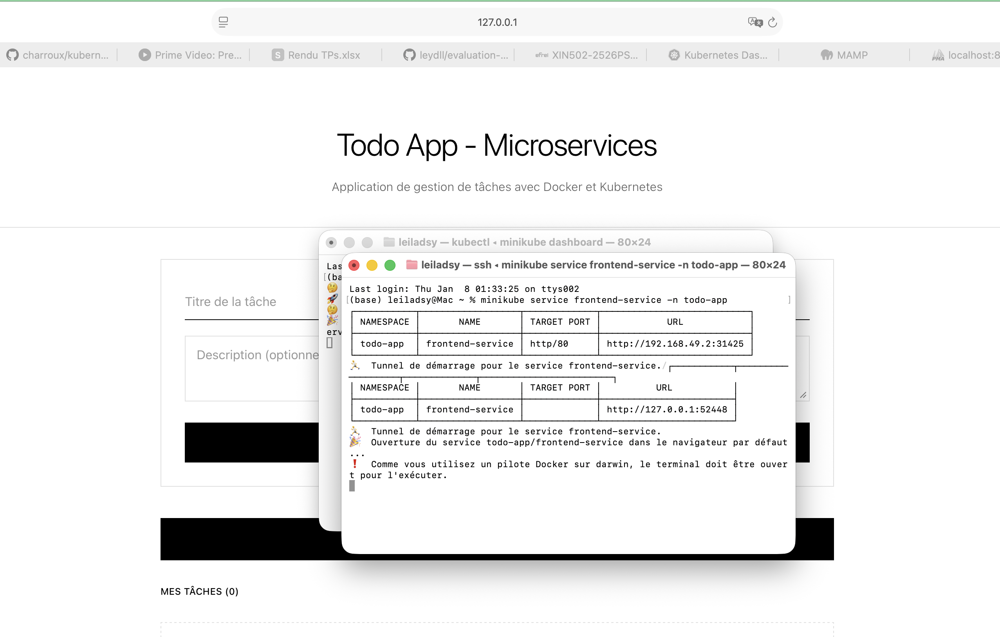

Configuration et démarrage de Minikube pour l'environnement Kubernetes local.

---

### 4. Namespaces Kubernetes

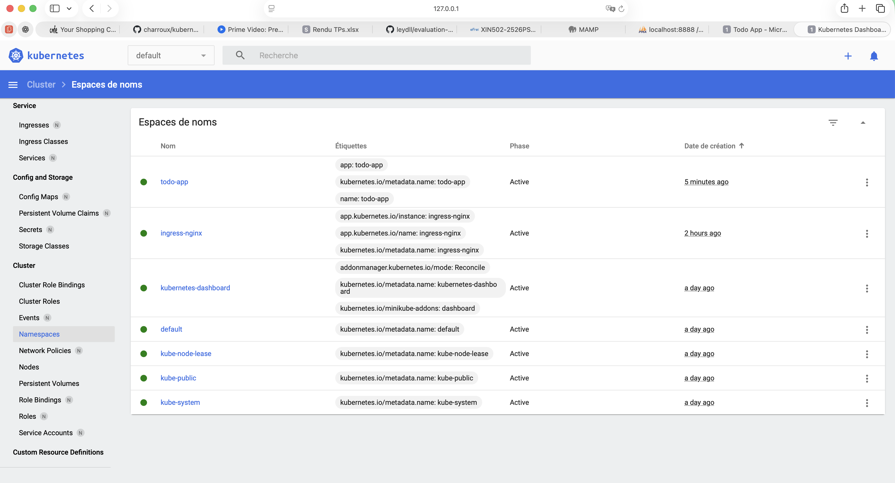

Création et configuration des namespaces Kubernetes pour organiser les ressources de l'application.

---

### 5. États des taches sur l'app

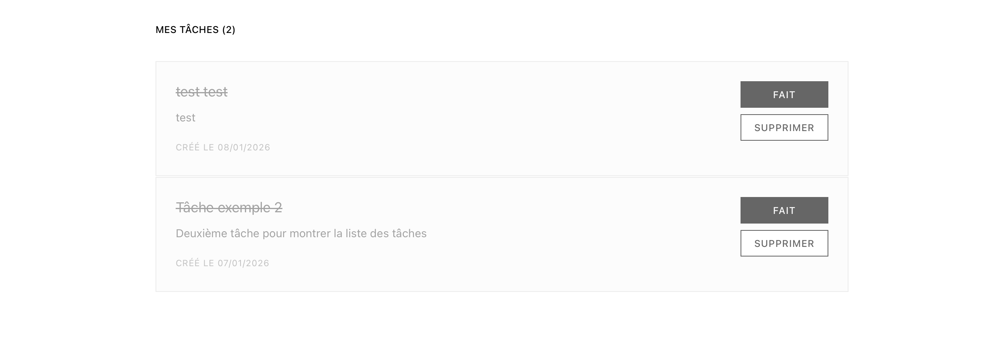

Vérification des états des taches faites ou à faire sur l'app.

---

### 6. État validé

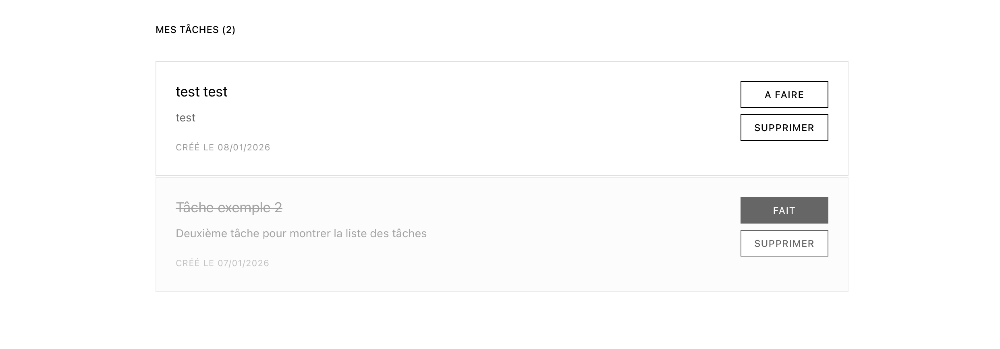

Confirmation que toutes les taches sont validées.

---

### 7. Événements de l'application

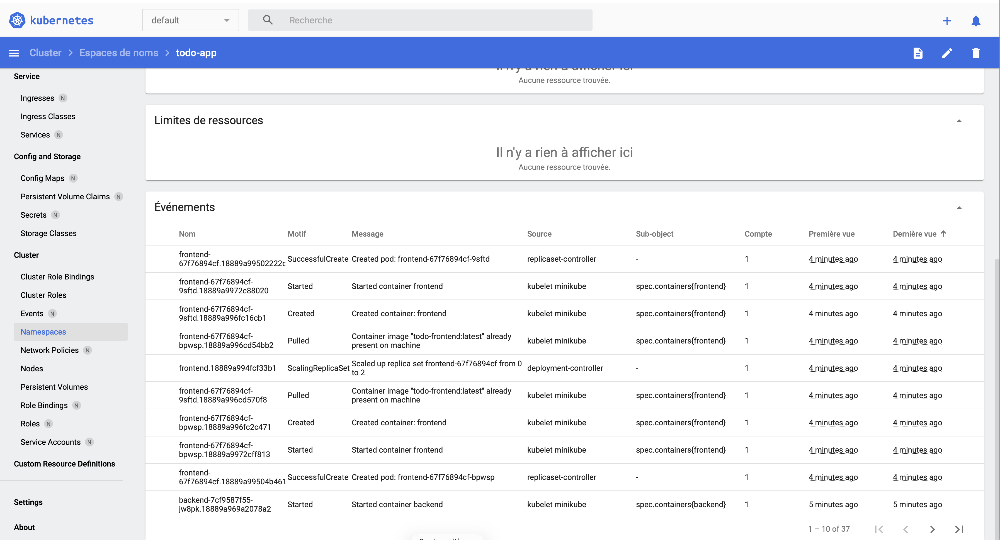

Visualisation des événements Kubernetes pour le déploiement de l'application.

---

### 8. Dashboard de l'application

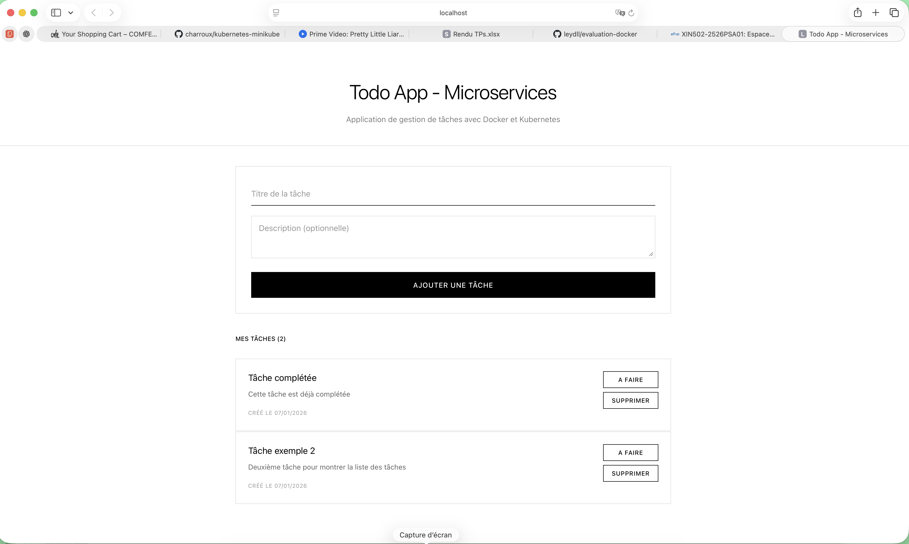

Interface de l'application Todo App avec la liste des tâches.

---

### 9. Données de l'application

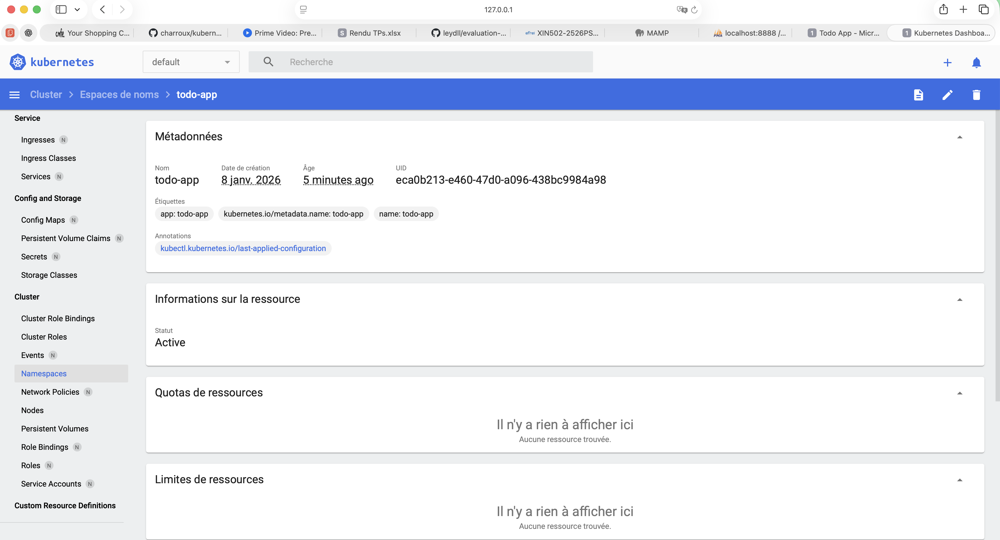

Affichage des données et du contenu de l'application Todo.

---

### 10. Test de l'API

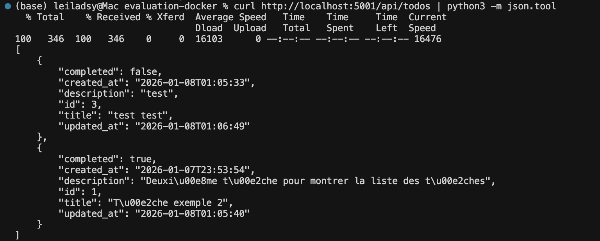

Test de l'API backend : vérification des endpoints et des réponses.

---

### 11. Test de l'API 2

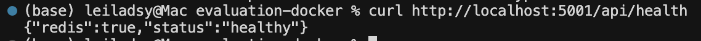

Suite des tests de l'API : vérification supplémentaire des fonctionnalités.

---

### 12. Ajout d'une tâche

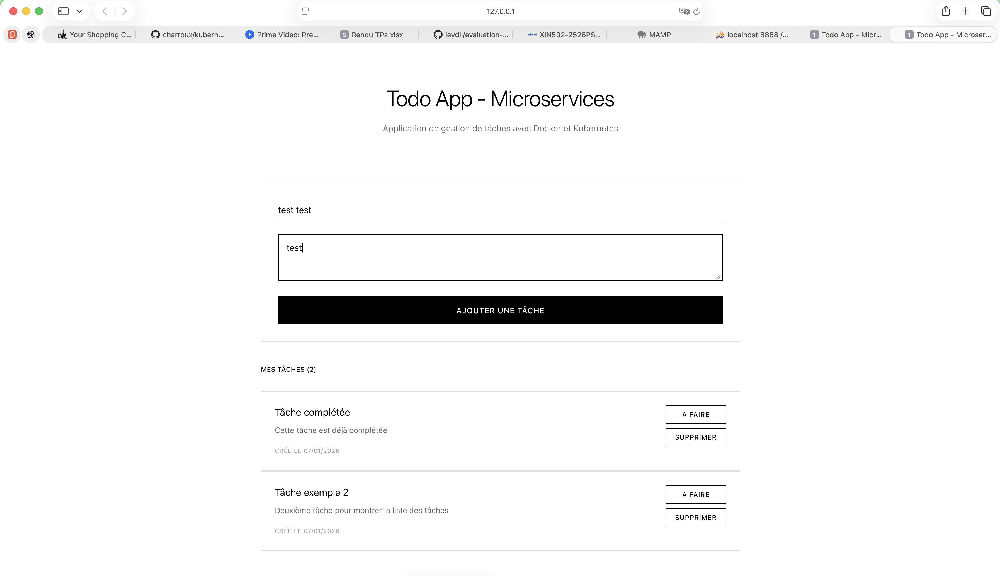

Interface permettant d'ajouter une nouvelle tâche dans l'application.

---

### 13. Nouvelle tâche

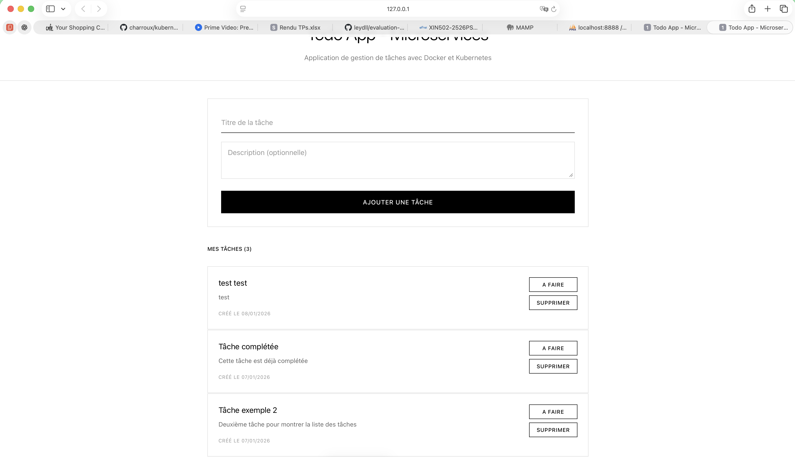

Ajout d'une nouvelle tâche sur la liste.

---

### 14. Suppression

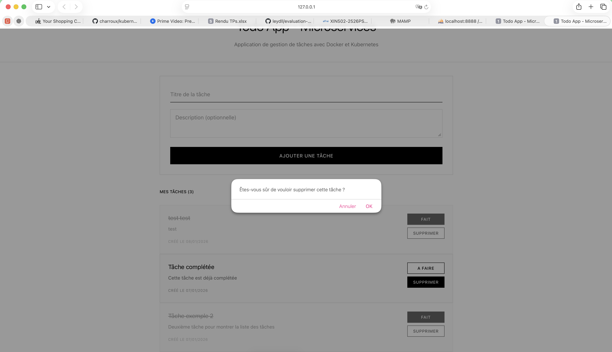

Suppression d'une tâche dans l'application Todo.

---

## Workflow du Déploiement

Les captures d'écran suivent ce workflow :

1. **Construction des images Docker** : Création des images pour le backend et le frontend
2. **Déploiement Docker Compose** : Lancement des conteneurs avec Docker Compose
3. **Configuration Kubernetes** : Configuration de Minikube et création des namespaces
4. **Déploiement Kubernetes** : Application des ressources et vérification des états
5. **Tests et Fonctionnalités** : Tests de l'API et utilisation de l'interface utilisateur

## Commandes Utiles

### Docker Compose
```bash
# Voir le statut
docker-compose ps

# Voir les logs
docker-compose logs -f backend
docker-compose logs -f frontend

# Voir les réseaux
docker network ls
docker network inspect evaluation-docker_todo-network
```

### Kubernetes
```bash
# Vérifier les pods
kubectl get pods -n todo-app

# Vérifier les services
kubectl get services -n todo-app

# Voir les logs
kubectl logs -f deployment/backend -n todo-app
kubectl logs -f deployment/frontend -n todo-app

# Décrire une ressource
kubectl describe pod <pod-name> -n todo-app

# Vérifier les secrets
kubectl get secrets -n todo-app

# Vérifier les PVC
kubectl get pvc -n todo-app

# Voir les événements
kubectl get events -n todo-app
```

## Structure du Projet

L'application est composée de :
- **Frontend** : Application React (port 3000 en Docker, port 80 dans Kubernetes)
- **Backend** : API Flask (port 5001 en Docker, port 5000 dans Kubernetes)
- **MySQL** : Base de données (port 3306)
- **Redis** : Cache (port 6379)
